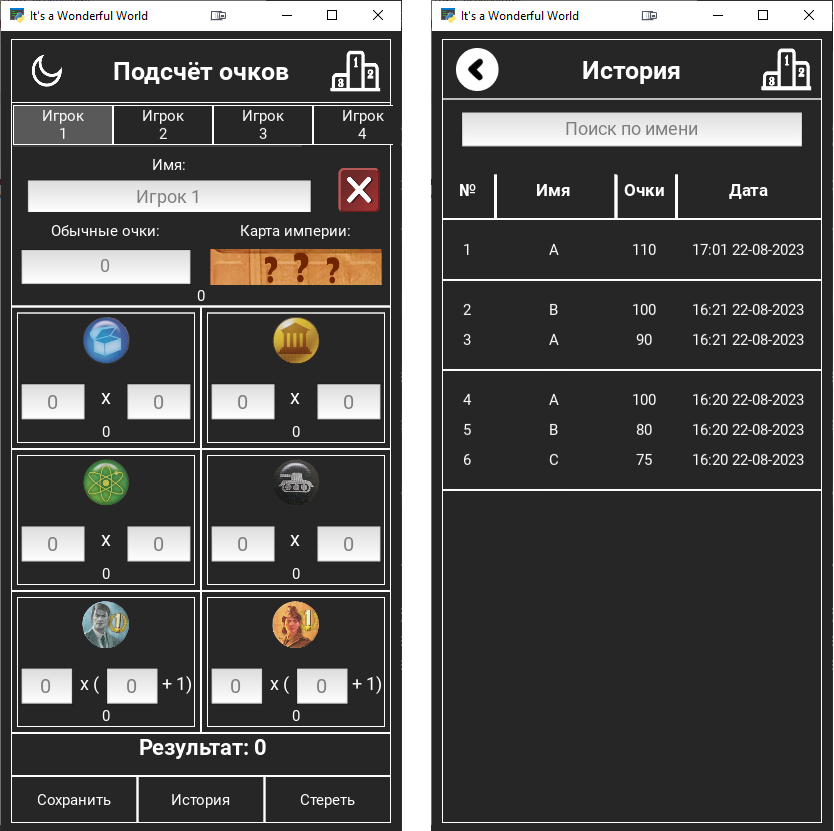

# ✦ It’s a Wonderful World (EN) ✦
“It’s a Wonderful World” is a small application to simplify scoring in the board game of the same name.

During scoring, the presenter enters the players' data into the application one by one, and then presses the “Save” button to save the game results in the sqlite database of the application.
Information on points scored in different categories is entered into the empty fields. Numbers entered through any non-numeric separator are summed.

To navigate between player data, use the tabs at the top.

The “X” button erases all entered information for the CURRENT player.

The “Стереть” button erases all entered information for ALL players.

The “История” button moves to the screen with the history of games. All games saved in the database are shown here (Names of players, their points in this game, date of the game). Each new game is separated by white stripes at the top and bottom.
>Screenshots of the application.

# ✦ It’s a Wonderful World (UA) ✦
"It's a Wonderful World" - це невелика програма для спрощення підрахунку очок в однойменній настільній грі.

Під час підрахунку очок, ведучий по черзі вводить дані гравців у програму, після чого натискає кнопку "Зберегти" для збереження результатів гри в sqlite базі даних програми.
У порожні поля вводиться інформація про очки, набрані за різними категоріями. Цифри введені через будь-який нечисловий роздільник сумуються.

Для переміщення між даними гравців використовуються вкладки згори.

Кнопка "Х" стирає всю введену інформацію щодо поточного гравця.

Кнопка "Стереть" стирає всю введену інформацію щодо ВСІХ гравців.

Кнопка "История" переміщується на екран з історією ігор. Тут показуються всі збережені у базі даних ігри (Імена гравців, їх очки у цій грі, дата проведення гри). Кожна нова гра відокремлена білими смугами зверху та знизу.

# ✦ It’s a Wonderful World (RU) ✦
“It’s a Wonderful World” - это небольшое приложение для упрощения подсчета очков в одноименной настольной игре.
Во время подсчета очков, ведущий поочередно вводит данные игроков в приложение, после чего нажимает кнопку "Сохранить" для сохранения результатов игры в sqlite базе данных приложения.
В пустые поля вводится информация по набраным по разным категориям очкам. Цифры введенные через любой нечисловой разделитель суммируются.
Для перемещения между данными игроков используються вкладки сверху.

Кнопка "Х" стерает всю введенную информацию по ТЕКУЩЕМУ игроку.

Кнопка "Стереть" стерает всю введенную информацию по ВСЕМ игрокам.

Кнопка "История" перемещает на экран с историей игр. Тут показываются все сохраненные в базу данных игры (Имена игроков, их очки в данной игре, дата проведения игры). Каждая новая игра отделена белыми полосами сверху и снизу.